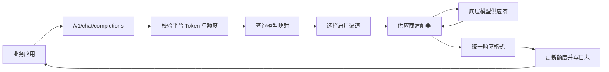

# API Transit Station 产品说明文档

## 1. 产品概述

API Transit Station 是一个面向企业和团队的 AI 模型 API 中转与运营平台。平台将 OpenAI、DeepSeek、Anthropic、Google Gemini、xAI Grok、OpenRouter、硅基流动、阿里云兼容接口、腾讯云兼容接口等供应商接入到统一网关中，对业务方提供一套 OpenAI Chat Completions 风格的调用入口。

平台的核心目标是让上层应用不直接感知底层模型供应商差异，通过统一模型名、渠道配置、调用令牌、额度控制和日志审计，把多模型接入从“分散写死在业务代码里”整理成“可配置、可运营、可审计”的基础设施能力。

## 2. 产品定位

### 2.1 目标用户

- 企业内部 AI 平台管理员：统一管理模型供应商、API Key、模型映射和调用策略。
- 业务应用开发者：通过统一接口调用模型，减少适配不同供应商 API 的成本。
- 终端使用团队或租户：自助创建封装 Key，查看个人调用消耗和示例代码。
- 运维与财务人员：通过请求日志、Token 消耗和渠道状态进行审计与成本核算。

### 2.2 核心价值

- 统一入口：对外暴露 `/v1/chat/completions`，业务接入方式接近 OpenAI SDK 习惯。
- 多供应商路由：通过公开模型名映射到底层渠道模型名，实现供应商切换和模型别名治理。
- Key 隔离：用户使用平台生成的封装 Key，底层供应商 Key 不暴露给调用方。
- 额度与审计：按调用 Token 记录使用量、成功/失败状态和请求日志。
- 管理后台：通过 Web 控制台管理渠道、模型映射、调用令牌和基础运营指标。

## 3. 角色与权限

### 3.1 普通用户

普通用户可以注册、登录、进入用户控制台，创建自己的封装 Key，选择公开模型进行调试，并查看个人调用日志和 Token 消耗。

主要能力：

- 查看个人资料。
- 创建、编辑、停用、删除个人封装 Key。
- 查看个人调用统计、近期日志和可用模型列表。
- 生成 cURL、JavaScript、Python 调用示例。
- 在控制台内直接发起模型调试请求。

### 3.2 管理员

管理员拥有平台级配置权限，可以管理所有供应商渠道、模型映射和 Token。

主要能力：

- 管理渠道：新增、编辑、启停、删除模型供应商渠道。
- 管理模型映射：配置公开模型名、渠道模型名、渠道归属、优先级和启用状态。
- 管理访问 Token：创建平台级 Token，设置额度与启用状态。
- 查看运营概览：渠道数量、启用渠道数、映射数量、Token 数、用户数、请求数、成功/失败数和总消耗 Token。

## 4. 核心功能

### 4.1 统一模型调用网关

平台对外提供 OpenAI 风格接口：

```http
POST /v1/chat/completions
Authorization: Bearer <platform-token>
Content-Type: application/json
```

请求体使用统一的 `model` 和 `messages` 格式。平台收到请求后，会按以下流程处理：

1. 解析 `Authorization` 中的平台 Token。
2. 校验 Token 是否存在、启用，以及是否超过额度。
3. 根据请求中的公开模型名查找启用的模型映射。
4. 按映射优先级选择目标渠道。
5. 根据渠道类型调用对应供应商适配器。
6. 将供应商响应转换为统一的 Chat Completions 响应。
7. 更新 Token 已用额度，并写入调用日志。

### 4.2 渠道管理

渠道代表一个底层模型供应商或兼容供应商实例。

主要字段：

- 渠道名称：例如 `DeepSeek Primary`。
- 渠道类型：例如 `openai`、`deepseek`、`anthropic`、`gemini`。
- Base URL：供应商 API 地址。
- API Key：底层供应商访问密钥。
- 模型列表：渠道可用模型名称，逗号分隔。
- 启用状态：控制该渠道是否参与转发。

当前后端已支持的渠道适配类型：

- OpenAI 兼容：`openai`、`deepseek`、`xai`、`openrouter`、`siliconflow`、`aliyun-compatible`、`tencent-compatible`。
- Anthropic Messages：`anthropic`、`deepseek-anthropic`。
- Google Gemini：`gemini`、`google`。

### 4.3 模型映射管理

模型映射用于把平台对外暴露的公开模型名，绑定到底层渠道的真实模型名。

示例：

| 公开模型名 | 渠道模型名 | 渠道 | 优先级 |
| --- | --- | --- | --- |
| `deepseek-chat` | `deepseek-chat` | DeepSeek Primary | 100 |
| `claude-sonnet` | `claude-sonnet-4` | Anthropic | 80 |
| `gemini-pro` | `gemini-2.5-pro` | Gemini | 70 |

同一个公开模型名可以配置多条映射。当前转发逻辑会选择启用且优先级最高的一条映射，用于实现默认主路由、备用渠道或灰度策略的基础能力。

### 4.4 Token 与额度管理

平台区分两类密钥：

- 底层供应商 API Key：保存在渠道配置中，只由后端使用。
- 平台封装 Key：分配给用户或业务调用方，用于访问统一网关。

Token 支持以下属性：

- Key 值：自动生成，格式类似 `sk-...` 或 `sk-user-...`。
- 归属用户：用于按用户统计用量。
- 名称：方便识别用途。
- 已用额度：根据成功响应中的 `usage.total_tokens` 累加。
- 总额度：大于 0 时启用额度上限，0 表示不限制。
- 启用状态：停用后不可继续调用。
- 过期时间字段：数据库已预留。

### 4.5 日志与用量审计

每次模型调用都会写入日志表，记录：

- 用户 ID。
- Token Key。
- 公开模型名。
- Prompt Token。
- Completion Token。
- Total Token。
- 成本字段。
- 调用状态：`SUCCESS` 或 `FAILED`。
- 创建时间。

这些日志支撑用户控制台、运营概览和后续成本核算。

### 4.6 模型市场

公共模型目录接口为前端模型市场提供数据：

```http
GET /public/models?page=1&size=12&query=&type=&sort=name
```

支持分页、关键词查询、供应商类型筛选和排序。若模型映射表为空，系统会从启用渠道的模型列表中推导可展示模型，作为降级展示方案。

### 4.7 用户控制台

用户控制台聚合普通用户的主要自助能力：

- 个人统计：请求数、成功数、失败数、累计 Token、最近调用时间。
- 封装 Key 卡片：查看 Key、复制、编辑额度、启停、删除。
- 在线调试：选择 Key 和模型后直接调用 `/v1/chat/completions`。
- 示例生成：自动生成 cURL、JavaScript、Python 调用示例。
- 实时日志：展示最近 20 条调用记录，前端按固定间隔刷新。

### 4.8 管理后台

管理后台包含以下页面：

- 渠道管理：维护供应商接入信息。
- 模型映射：维护公开模型与渠道模型之间的映射关系。
- Token 管理：维护平台级访问 Token。
- 首页/运营概览：展示总体接入状态与运营指标。

### 4.9 成品服务订单

平台新增 Plus 会员服务订单模块，用于登记合规的会员服务类数字商品订单。该模块不保存、不展示、不下载第三方账号密码或登录凭证，仅生成订单凭证、订单状态和履约备注。

用户侧能力：

- 查看 成品服务商品。
- 创建 成品服务订单。
- 查看个人订单列表。
- 下载订单凭证文本文件。

管理员侧能力：

- 查看全部 成品服务订单。
- 更新订单状态：`PENDING`、`CONFIRMED`、`FULFILLED`、`CANCELLED`。
- 填写履约备注。

## 5. 关键业务流程

### 5.1 管理员配置模型供应商

1. 管理员登录后台。
2. 新增渠道，填写供应商类型、Base URL、API Key 和可用模型。
3. 新增模型映射，将公开模型名绑定到渠道模型名。
4. 设置映射优先级和启用状态。
5. 用户或业务方即可通过公开模型名发起调用。

### 5.2 用户创建封装 Key 并调用模型

1. 用户注册并登录。
2. 进入用户控制台创建封装 Key。
3. 选择公开模型并复制示例代码。
4. 业务应用携带封装 Key 调用统一网关。
5. 平台完成路由、转发、响应转换和日志记录。
6. 用户在控制台查看消耗与调用结果。

### 5.3 请求转发与审计



## 6. 系统架构

### 6.1 技术栈

后端：

- Java 17。
- Spring Boot 3.4.4。
- Spring WebFlux。
- Spring Security。
- MyBatis-Plus。
- JDBC / Spring Data JDBC。
- MySQL，开发和测试环境可使用 H2。
- JWT 与 OAuth Token 表结构。

前端：

- Vue 3。
- Vite 5。
- TypeScript。
- Vue Router。
- Element Plus。
- Axios。
- Tailwind CSS 依赖已引入。

### 6.2 后端模块

- `controller`：REST API 控制器，包括认证、用户、渠道、映射、Token、运营、OAuth、模型调用。
- `service`：业务服务，包括转发、认证、OAuth、运营统计和当前用户校验。
- `provider`：供应商适配层，屏蔽 OpenAI 兼容、Anthropic、Gemini 等接口差异。
- `model`：数据库实体。
- `mapper`：MyBatis-Plus 数据访问接口。
- `dto`：请求和响应对象。
- `config`：安全、跨域和 WebClient 配置。

### 6.3 前端模块

- 用户布局：承载首页、模型市场、登录注册和用户控制台。
- 管理布局：承载渠道、Token、模型映射等后台页面。
- HTTP 工具：统一 Axios 实例与认证头处理。
- 路由守卫：根据本地 Token 和用户角色控制普通用户页与管理员页访问。

## 7. 数据模型概览

| 表名 | 说明 |
| --- | --- |
| `users` | 用户账号、角色、余额。 |
| `channels` | 供应商渠道配置。 |
| `model_mappings` | 公开模型名到渠道模型名的映射。 |
| `tokens` | 平台封装 Key、额度和启用状态。 |
| `logs` | 模型调用日志与 Token 消耗。 |
| `oauth_clients` | OAuth 客户端配置。 |
| `oauth_codes` | OAuth 授权码。 |
| `oauth_tokens` | 登录和 OAuth Token。 |
| `oauth_user_bindings` | 第三方 OAuth 用户绑定。 |
| `other_services` | 成品服务商品配置。 |
| `service_orders` | 成品服务订单状态和履约信息。 |

## 8. 主要接口清单

### 8.1 认证

- `POST /auth/register`：注册用户。
- `POST /auth/login`：登录并返回访问令牌。
- `POST /auth/logout`：登出并撤销令牌。

### 8.2 用户侧

- `GET /user/profile`：获取当前用户资料。
- `GET /user/dashboard`：获取控制台聚合数据。
- `GET /user/tokens`：获取当前用户 Token。
- `POST /user/tokens`：创建当前用户 Token。
- `PUT /user/tokens/{id}`：更新当前用户 Token。
- `DELETE /user/tokens/{id}`：删除当前用户 Token。
- `GET /user/logs`：获取当前用户调用日志。
- `GET /user/stats`：获取当前用户统计。
- `GET /user/tokens/{id}/examples`：生成调用示例。

### 8.3 管理侧

- `GET /channels`：获取渠道列表。
- `POST /channels`：创建渠道。
- `PUT /channels/{id}`：更新渠道。
- `DELETE /channels/{id}`：删除渠道。
- `GET /mappings`：获取模型映射列表。
- `POST /mappings`：创建模型映射。
- `PUT /mappings/{id}`：更新模型映射。
- `DELETE /mappings/{id}`：删除模型映射。
- `GET /tokens`：获取所有 Token。
- `POST /tokens`：创建平台级 Token。
- `PUT /tokens/{id}`：更新平台级 Token。
- `DELETE /tokens/{id}`：删除平台级 Token。

### 8.4 公共与运营

- `POST /v1/chat/completions`：统一模型调用入口。
- `GET /public/models`：公共模型目录。
- `GET /ops/overview`：运营总览。
- `GET /ops/catalog`：供应商推荐目录。

### 8.5 成品服务订单

- `GET /public/other-services`：获取 成品服务商品。
- `POST /service-orders`：创建当前用户的 成品服务订单。
- `GET /service-orders`：获取当前用户订单。
- `GET /service-orders/{id}`：获取当前用户指定订单。
- `GET /service-orders/{id}/download`：下载订单凭证。
- `GET /service-orders/admin/orders`：管理员获取全部 成品服务订单。
- `PUT /service-orders/admin/orders/{id}`：管理员更新订单状态和履约备注。

### 8.6 OAuth

- `GET /oauth/authorize`：生成第三方授权地址。
- `GET /oauth/callback/{provider}`：处理第三方回调。
- `POST /oauth/token`：授权码或刷新令牌换取 Token。
- `POST /oauth/refresh`：刷新 Token。
- `POST /oauth/revoke`：撤销 Token。
- `POST /oauth/logout`：OAuth 登出。

## 9. 配置与运行

### 9.1 后端配置

默认后端端口：

```yaml
server:
  port: 8089
```

常用环境变量：

| 环境变量 | 说明 | 默认值 |
| --- | --- | --- |
| `SERVER_PORT` | 后端服务端口 | `8089` |
| `DB_URL` | 数据库连接地址 | MySQL 本地地址 |
| `DB_USERNAME` | 数据库用户名 | `root` |
| `DB_PASSWORD` | 数据库密码 | `123456` |
| `DB_DRIVER` | JDBC Driver | `com.mysql.cj.jdbc.Driver` |
| `JWT_SECRET` | JWT 签名密钥 | 开发默认值 |
| `JWT_EXPIRATION_MS` | JWT 过期时间 | `86400000` |
后端启动命令：

```bash
./mvnw spring-boot:run
```

Windows：

```powershell
.\mvnw.cmd spring-boot:run
```

### 9.2 前端配置

前端位于 `web` 目录。

```bash
npm install
npm run dev
```

生产构建：

```bash
npm run build
```

## 10. 当前实现状态

已实现：

- 用户注册、登录、登出。
- 平台 Token 与用户 Token 管理。
- 渠道管理。
- 模型映射管理。
- OpenAI 兼容、Anthropic、Gemini 三类供应商适配。
- 统一 Chat Completions 调用入口。
- 调用日志、额度累计和运营概览。
- 公共模型市场接口。
- 用户控制台与管理员后台基础页面。
- 成品服务商品、订单和订单凭证下载。

待完善或建议增强：

- 流式响应：请求对象包含 `stream` 字段，但当前统一响应以非流式 `Mono<ChatResponse>` 为主。
- 多映射容灾：当前只选择最高优先级映射，后续可加入失败自动切换备用渠道。
- 成本计费：当前 `cost` 字段按 Token 总量记录，可扩展为按模型单价计费。
- Token 过期校验：数据库已预留 `expired_at`，当前核心校验主要是启用状态与额度。
- 管理接口权限保护：多数管理接口已调用管理员校验，运营接口目前更偏公共展示，可按部署场景收紧权限。
- 前端中文文案编码：部分 Vue 文件在当前终端环境显示异常，建议统一确认文件编码为 UTF-8。
- 敏感配置：生产环境应通过环境变量注入供应商 Key、数据库密码和 JWT Secret，避免使用开发默认值。
- 成品服务履约：支持自动发货与人工处理，交付内容仅对订单所有者和管理员可见。

## 11. 适用场景

- 企业内部统一大模型网关。
- 多模型供应商统一接入层。
- AI 应用开发环境的 Key 分发与额度控制。
- 需要审计模型调用日志和消耗的团队项目。
- 希望未来支持模型路由、供应商容灾、成本治理的平台雏形。

## 12. 产品演进方向

短期可优先补齐：

- 管理员初始化与角色管理。
- 流式调用支持。
- 渠道健康检查。
- 失败重试与备用渠道切换。
- 按模型、用户、Token、日期维度的用量报表。

中期可扩展：

- 模型价格表与真实成本计算。
- 多租户组织管理。
- 供应商限速、并发控制和熔断。
- OpenAI SDK 完整兼容测试。
- API 文档页面和密钥安全审计。

长期可建设：

- 策略化路由：按成本、延迟、质量、地域、供应商健康度动态选择模型。
- 提示词模板与应用级网关。
- 统一 Embeddings、Images、Audio 等更多模型能力。
- 企业 SSO、审计报表和财务结算体系。
